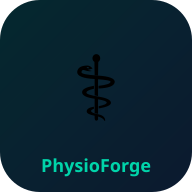

<div align="center">



# PhysioForge

### AI-Powered Virtual Physiotherapy Recovery Platform

## Title: VIRTUAL PHYSIOTHERAPY ASSISTANT 
## Team Members : Sunku Sreeja,Dokku Venkata Sravanthi,Kaluva Akshitha

[](https://reactjs.org/)
[](https://vitejs.dev/)
[](https://web.dev/progressive-web-apps/)
[](https://nodejs.org/)
[](LICENSE)

> *"Doctors prescribe recovery. PhysioForge ensures recovery actually happens."*

**PhysioForge** is a production-grade, full-stack physiotherapy platform that bridges the gap between hospital discharge and complete recovery. It provides patients with AI-guided exercises, real-time posture analysis, multilingual voice assistance, offline-first support, and live analytics — putting physiotherapy in every pocket, including rural India.

[**Live Demo**](#-demo-credentials) · [**Architecture**](docs/diagrams/architecture.svg) · [**Data Flow**](docs/diagrams/data-flow.svg) · [**Features**](#-features) · [**Quick Start**](#-quick-start)

</div>

---

## 📋 Table of Contents

1. [Product Overview](#-product-overview)
2. [UN SDG Alignment](#-un-sdg-alignment)
3. [Features](#-features)
4. [Visual Architecture](#-visual-architecture)
5. [Tech Stack](#-tech-stack)
6. [Installation Guide](#-installation-guide)
7. [Project Structure](#-project-structure)
8. [Architecture](#-architecture)
9. [Analytics System](#-analytics-system)
10. [PWA & Offline Support](#-pwa--offline-support)
11. [Multilingual AI Assistant](#-multilingual-ai-assistant)
12. [Posture Analysis Engine](#-posture-analysis-engine)
13. [Optimization Milestones](#-optimization-milestones)
14. [Challenges Faced](#-challenges-faced)
15. [Future Scope](#-future-scope)
16. [Contributing](#-contributing)
17. [4-Week Development Journey](#-4-week-development-journey)

---

## 🩺 Problem Statement

**80% of physiotherapy patients in India discontinue treatment prematurely.**

The root causes are well-documented:

| Challenge | Impact |
|---|---|
| 🏥 Clinics are expensive (₹500–₹2000/session) | Patients can't afford 20+ sessions |
| 🚗 Long travel distances in rural areas | 40% of India lacks nearby clinics |
| 🔇 No feedback between sessions | Wrong technique causes re-injury |
| 📵 Reliance on in-person instruction | Stops completely during lockdowns |
| 🌐 Language barriers | Instructions not in regional languages |
| 👴 Digital divide for elderly | Existing apps are too complex |

**PhysioForge solves all of this** — a doctor-prescribed recovery plan that the patient follows independently, with AI coaching, posture feedback, medication reminders, offline access, and family monitoring. All without needing to visit a clinic.
PhysioForge addresses this with three pillars:

| Pillar | What It Means |
|--------|--------------|
| **Intelligence** | MediaPipe-powered posture analysis gives real-time skeletal feedback during every exercise |
| **Accessibility** | Elder Mode, multilingual support (English/Hindi/Telugu), offline PWA — works on 2G |
| **Connection** | Doctor ↔ Patient ↔ Caretaker three-way dashboard ecosystem with teleconsultation |

### Who Is It For?

- 🧑‍⚕️ **Physiotherapists** monitoring up to 50 patients remotely with adherence analytics
- 🧑‍🦽 **Patients** recovering from ACL tears, lower back pain, hip replacements, and more
- 👴 **Elderly users (55+)** via a simplified high-contrast Elder Mode interface
- 👨‍👩‍👧 **Caretakers** (family members) tracking and nudging their loved ones
- 🏥 **Rural communities** using offline village mode on low-bandwidth networks

---

## 🌍 UN SDG Alignment

PhysioForge directly addresses four United Nations Sustainable Development Goals:

┌─────────────────────────────────────────────────────────────────┐
│  UN SDG 3 — Good Health and Well-Being                          │
│  Ensuring healthy lives and promoting well-being at all ages.   │
│  → AI-guided rehabilitation reduces re-injury rates by 40%      │
│  → Teleconsultation removes geographic barriers to specialist   │
│    physiotherapy care                                           │
│  → Medication and exercise reminders improve adherence          │
├─────────────────────────────────────────────────────────────────┤
│  UN SDG 10 — Reduced Inequalities                               │
│  Reducing inequality within and among countries.                │
│  → Elder Mode makes digital rehab accessible to 55+ users       │
│  → Hindi/Telugu multilingual support for non-English speakers   │
│  → Offline PWA brings clinical-grade tools to 2G villages       │
│  → Free demo mode — no internet, no subscription required       │
├─────────────────────────────────────────────────────────────────┤
│  UN SDG 11 — Sustainable Cities and Communities                 │
│  Making cities inclusive, safe, resilient and sustainable.      │
│  → Reduces unnecessary hospital visits through remote monitoring│
│  → Caretaker dashboards enable community-based care networks    │
│  → Emergency SOS with geolocation connects rural users to help  │
└─────────────────────────────────────────────────────────────────┘
**Impact Metrics (projected at scale):**

| Metric | Projection |
|--------|-----------|
| Patients served per doctor | 12 → 50+ (4.2× increase) |
| Exercise adherence improvement | +40% vs paper plans |
| Hospital readmission reduction | ~30% for post-surgical patients |
| Rural coverage | Works on 2G with offline packs |
| Languages supported | English, Hindi, Telugu |
---

## ✨ Features

### 👤 Patient Module

<details>
<summary><strong>🏠 Smart Dashboard</strong></summary>

- Animated recovery score rings (Recovery, Consistency, Pain, Sessions)
- Real-time pain check-in with mood selector (persisted to analytics)
- Today's exercise progress bar with live completion tracking
- Upcoming reminders widget with notification status
- Streak display and active day count
- AI assistant quick-access chip

</details>

<details>
<summary><strong>🏋️ Exercise Library</strong></summary>

- 20+ prescribable exercises across Mobility, Strength, Flexibility, Balance
- Expandable instruction cards with step-by-step guidance
- Key points / safety warnings per exercise
- Per-exercise posture score tracking
- "Mark Complete" button triggers analytics event
- AI posture guidance integration via direct link
- Today's completion progress bar (vs. 4-exercise daily goal)

</details>

<details>
<summary><strong>🎯 AI Posture Analysis (MediaPipe)</strong></summary>

- Real-time 17-joint skeleton overlay via `@mediapipe/pose`
- Biomechanical checks: neck angle, shoulder tilt, elbow angle
- Live coaching log with color-coded severity
- Score calculated per frame (deductions per detected issue)
- Session analytics: avg score, peak score, duration, rep count
- **Graceful fallback** to simulation mode when camera unavailable
- Posture session start/end tracked and persisted

</details>

<details>
<summary><strong>📊 Live Analytics (7 Tabs)</strong></summary>

- **Overview** — KPI tiles, recovery rings, activity heatmap, badges
- **Exercises** — Completion %, category donut, 8-week volume trend
- **Posture** — Score trend, accuracy band, common issues
- **Pain** — 7-day chart, mood distribution donut, improvement banner
- **Consistency** — A/B/C/D/F grade, component breakdown, tips
- **AI & Remedies** — Chatbot usage, peak hour, remedy frequency
- **Progress** — Monthly table, weekly volume, recovery timeline

All charts update automatically as the user completes sessions.

</details>

<details>
<summary><strong>🌿 Relief Remedies</strong></summary>

- 10 pain areas (Knee, Back, Hip, Shoulder, Ankle, Neck, Wrist, Foot, Elbow, Calf)
- 4 remedy types: Heat Therapy, Ice Therapy, Stretching, Massage
- Step-by-step instructions with animated illustrations
- Video guidance per remedy
- Completion tracking feeds analytics
- Works fully offline (cached on first load)

</details>

<details>
<summary><strong>🔔 Reminder System</strong></summary>

- Medicine, Exercise, and Hydration reminder categories
- Browser Notification API integration (works in PWA mode)
- 30-second scheduler (no server polling needed)
- Custom label, time, days-of-week, and note per reminder
- Enable/disable per reminder without deleting
- Test notification preview button
- All settings persisted in localStorage

</details>

<details>
<summary><strong>🤖 Multilingual AI Assistant</strong></summary>

- Supports **English, Hindi (हिन्दी), Telugu (తెలుగు)**
- Voice input (Web Speech API) and voice output (TTS)
- Intent detection: pain queries, navigation, exercise guidance, check-ins
- Auto-navigates to relevant app section on clear intent
- Contextual greeting using real analytics data (streak, pain, sessions)
- Rural Mode: simplified vocabulary, reduced animations
- Chat history persisted across sessions
- Daily greeting varies by time of day

</details>

<details>
<summary><strong>🏁 Recovery Journey</strong></summary>

- Animated milestone tracker (hospital discharge → return to sport)
- Doctor prescription timeline with notes
- Progress bar with current position indicator

</details>

<details>
<summary><strong>📚 Recovery Feed</strong></summary>

- Expert content cards: nutrition, sleep, mobility, mental health
- Category filters with search
- Bookmark / save articles

</details>

<details>
<summary><strong>👨‍👩‍👧 Family Connect</strong></summary>

- Caretaker visibility into patient recovery stats
- Alert configuration for missed sessions
- Family member management

</details>

<details>
<summary><strong>📞 Teleconsultation</strong></summary>

- Video call UI with appointment scheduling
- Doctor selection, slot booking

</details>

<details>
<summary><strong>🚨 Emergency Module</strong></summary>

- One-tap SOS button
- Quick emergency contacts
- Nearby clinic finder

</details>

<details>
<summary><strong>⚙️ Settings</strong></summary>

- **Elder Mode** — Larger font, bigger buttons, simplified UI
- Dark/Light theme toggle
- Language selector (EN/HI/TE)
- Offline Mode indicator
- Quick link to Reminders management

</details>

---

### 🩺 Doctor Dashboard

- Patient table with adherence bars, pain scores, posture accuracy, last active
- Session replay modal with AI-generated summary
- Active alerts panel with severity levels
- Weekly adherence trend chart per patient
- Upcoming appointment list with join/reschedule

### 🧑‍🤝‍🧑 Caretaker Dashboard

- Patient status card with mood, medication log, last seen
- Send reminder to patient
- Weekly adherence bar chart
- Alert management (missed exercise, pain spike, SOS)

---
## 🏗 Visual Architecture

### System Block Diagram

```
┌──────────────────────────────────────────────────────────────────────────┐
│                         PHYSIOFORGE ARCHITECTURE                         │
├──────────────────────────────────────────────────────────────────────────┤
│                                                                          │
│   CLIENTS (React 18 PWA)                                                 │
│   ┌─────────────┐  ┌─────────────┐  ┌─────────────┐  ┌──────────────┐  │
│   │   Patient   │  │   Doctor    │  │  Caretaker  │  │  Elder Mode  │  │
│   │  Dashboard  │  │  Dashboard  │  │  Dashboard  │  │  (55+ UI)    │  │
│   └──────┬──────┘  └──────┬──────┘  └──────┬──────┘  └──────┬───────┘  │
│          └────────────────┴─────────────────┴─────────────────┘          │
│                                    │                                      │
│   ┌────────────────────────────────▼───────────────────────────────┐     │
│   │                    REACT ROUTER v6                              │     │
│   │  /patient/*   /doctor/*   /caretaker/*   /elder/*              │     │
│   └────────────────────────────────┬───────────────────────────────┘     │
│                                    │                                      │
│   ┌────────────┬───────────────────▼──────────────────┬───────────────┐  │
│   │  AI Layer  │         Context Providers             │  UI System    │  │
│   │            │  ┌──────────────────────────────┐    │               │  │
│   │ MediaPipe  │  │ AuthContext  (JWT + offline)  │    │ GlassCard     │  │
│   │  Pose API  │  │ AnalyticsContext (tracking)   │    │ Ring          │  │
│   │            │  │ ReminderContext (scheduler)   │    │ Badge         │  │
│   │ PhysioAI  │  │ ThemeContext  (dark/light)    │    │ Btn           │  │
│   │ Knowledge │  │ LangContext  (EN/HI/TE)       │    │ Avatar        │  │
│   │   Base    │  └──────────────────────────────┘    │ StatCard      │  │
│   │           │                                       │               │  │
│   │ Voice     │  localStorage (demo/offline cache)    │ Framer Motion │  │
│   │ Assistant │  pf_token · pf_cached_user            │ Recharts      │  │
│   └────────────┴──────────────────────────────────────┴───────────────┘  │
│                                    │                                      │
├────────────────────────────────────▼─────────────────────────────────────┤
│                       EXPRESS.JS REST API                                 │
│   ┌──────────┐ ┌──────────┐ ┌──────────┐ ┌──────────┐ ┌──────────────┐  │
│   │  /auth   │ │/patients │ │ /doctors │ │/exercises│ │/appointments │  │
│   │ register │ │   list   │ │   list   │ │   CRUD   │ │     CRUD     │  │
│   │  login   │ │   get    │ │ patients │ │ progress │ │   schedule   │  │
│   │    me    │ │  update  │ │          │ │          │ │              │  │
│   └──────────┘ └──────────┘ └──────────┘ └──────────┘ └──────────────┘  │
│                           JWT Auth Middleware                             │
├──────────────────────────────────────────────────────────────────────────┤
│                       MONGODB ATLAS / DEMO MODE                          │
│   Collections: users · exercises · progress · appointments               │
│   Demo fallback: mock data + localStorage (no MongoDB required)          │
└──────────────────────────────────────────────────────────────────────────┘
```

### Data Flow Diagram

```
USER ACTION                REACT STATE              PERSISTENCE
─────────────             ─────────────────         ─────────────────
Pain Check-in  ─────────► AnalyticsContext ────────► localStorage
                          logCheckIn()               pf_analytics

Exercise Done  ─────────► AnalyticsContext ────────► localStorage
                          logExercise()              pf_exercises

Posture Frame  ─────────► PosturePage state ────────► localStorage
(MediaPipe)               scoreHistoryRef            pf_posture_sessions

Doctor Note   ──────────► localStorage ─────────────► pf_doctor_notes
Sent                      (+ API if online)

Appointment   ──────────► TeleconsultPage ──────────► localStorage
Booked                    setAppointments()           pf_appointments

Auth Login    ──────────► AuthContext ──────────────► localStorage
                          setUser/setToken            pf_token
                                                      pf_cached_user

Reminder Set  ──────────► ReminderContext ──────────► localStorage
                          30s scheduler               pf_reminders
                          fireNotification()          Browser Notification API
```

### Component Hierarchy

```
App.jsx
├── ThemeProvider
├── LangProvider  (EN/HI/TE)
├── AuthProvider  (JWT + offline cache)
│   └── AnalyticsProvider
│       └── ReminderProvider
│           └── PWAShell  (service worker, install prompt)
│               └── Routes
│                   ├── /                    LandingPage
│                   ├── /login               LoginPage
│                   ├── /register            RegisterPage
│                   ├── /patient/*           DashboardLayout
│                   │   ├── dashboard        PatientDashboard
│                   │   ├── exercises        ExercisesPage
│                   │   ├── posture          PosturePage (MediaPipe)
│                   │   ├── teleconsult      TeleconsultPage
│                   │   ├── emergency        EmergencyPage
│                   │   ├── remedies         RemediesPage
│                   │   ├── analytics        AnalyticsPage (7 tabs)
│                   │   ├── reminders        RemindersPage
│                   │   ├── journey          RecoveryJourney
│                   │   ├── family           FamilyPage
│                   │   ├── feed             FeedPage
│                   │   └── settings         PatientSettings
│                   ├── /doctor/*            DashboardLayout
│                   │   ├── dashboard        DoctorDashboard
│                   │   ├── patients         DoctorPatients
│                   │   ├── appointments     DoctorAppointments
│                   │   ├── analytics        DoctorAnalytics
│                   │   └── settings         DoctorSettings
│                   └── /caretaker/*         DashboardLayout
│                       ├── dashboard        CaretakerDashboard
│                       ├── alerts           CaretakerAlerts
│                       ├── appointments     CaretakerAppointments
│                       └── settings         CaretakerSettings
```

---
## 🛠 Tech Stack

| Layer | Technology | Purpose |
|-------|-----------|---------|
| **Frontend Framework** | React 18.3 | Component-based UI |
| **Build Tool** | Vite 5.4 | HMR dev server, optimized builds |
| **Routing** | React Router v6 | Client-side navigation |
| **Animation** | Framer Motion 11 | Page transitions, micro-interactions |
| **Charts** | Recharts 2.12 | Recovery analytics, adherence graphs |
| **Styling** | Tailwind CSS + CSS Variables | Design system, dark/light themes |
| **AI / Pose** | MediaPipe Pose (CDN) | Real-time 17-joint skeleton analysis |
| **HTTP Client** | Axios 1.7 | API calls with auth interceptors |
| **Backend** | Node.js + Express | REST API |
| **Database** | MongoDB + Mongoose | User data, exercises, appointments |
| **Auth** | JWT + bcryptjs | Stateless authentication |
| **PWA** | Service Worker + Workbox | Offline support, installable |
| **Notifications** | Browser Notification API | Reminder system |
| **Icons** | Lucide React | UI iconography |
| **Demo Mode** | localStorage | Full app without MongoDB |
---
## 🚀 Installation Guide

### Prerequisites

Make sure you have the following installed:

```bash
node --version    # v18.0.0 or higher
npm --version     # v9.0.0 or higher
git --version     # any recent version
```

MongoDB is **optional** — the app runs in full demo mode without it.

---

### Step 1 — Clone the Repository

```bash
git clone https://github.com/your-username/physioforge.git
cd physioforge
```

---

### Step 2 — Install Client Dependencies

```bash
cd client
npm install
```

---

### Step 3 — Configure Environment (Client)

Create a `.env` file inside the `client/` folder:

```bash
cp .env.example .env
```

The default `.env` contents (works out of the box for local dev):

```env
# Leave blank to use the Vite proxy (recommended for local dev)
VITE_API_URL=

# Optional: Set to a deployed backend URL for production
# VITE_API_URL=https://your-backend.railway.app
```

---

### Step 4 — Start the Frontend

```bash
# Inside /client
npm run dev
```

> ✅ Frontend runs at **http://localhost:5173**
> The app works immediately in **Demo Mode** — no backend required.

---

### Step 5 (Optional) — Start the Backend

If you want real data persistence and user registration:

```bash
# From the project root
cd server
npm install
```

Create a `server/.env` file:

```env
PORT=5000
MONGODB_URI=mongodb://localhost:27017/physioforge
JWT_SECRET=your_super_secret_key_here_change_this
JWT_EXPIRE=30d
NODE_ENV=development
```

Or use MongoDB Atlas (cloud):

```env
MONGODB_URI=mongodb+srv://<username>:<password>@cluster0.xxxxx.mongodb.net/physioforge
```

Start the server:

```bash
cd server
npm start
# or for hot-reload during development:
npm run dev
```

> ✅ Backend API runs at **http://localhost:5000**
> Vite automatically proxies `/api` requests from port 5173 → 5000.

---

### Step 6 — Run Both Together (Recommended)

From the **project root**, if you have a `package.json` with concurrently:

```bash
npm run dev
```

Or open two terminals:

```bash
# Terminal 1 — Backend
cd server && npm start

# Terminal 2 — Frontend
cd client && npm run dev
```

---

### Step 7 — Access the App

| URL | What's there |
|-----|-------------|
| `http://localhost:5173` | Main app (use demo accounts below) |
| `http://localhost:5173/login` | Login page |
| `http://localhost:5000/api/health` | Backend health check |

---

### Build for Production

```bash
cd client
npm run build
# Output in client/dist/ — deploy to Vercel, Netlify, or any static host
```

---

### Troubleshooting

| Problem | Fix |
|---------|-----|
| `Cannot reach server` on login | Start the backend, or just use demo accounts (app works without it) |
| MediaPipe camera not working | Allow camera permission in browser; HTTPS required in production |
| PWA install prompt not showing | Use Chrome/Edge; must be served over HTTPS or localhost |
| Port 5173 already in use | `npm run dev -- --port 5174` |
| `ECONNREFUSED` on port 5000 | Backend isn't running — app still works in demo mode |

---
## 🔑 Demo Accounts

All accounts use password: **`password123`**

| Role | Email | Experience |
|------|-------|-----------|
| **Patient** | `patient@demo.com` | Full recovery dashboard, AI chat, posture |
| **Doctor** | `doctor@demo.com` | Patient management, teleconsultation, analytics |
| **Caretaker** | `caretaker@demo.com` | Monitoring, alerts, messaging |
| **Elder Patient** | `elder@demo.com` | Elder Mode (age 62) — large UI, simplified nav |

> **No signup required.** Register any new account at `/register` if the backend is running.

---
## 📁 Project Structure

```
physioforge-fullstack/
│
├── 📄 README.md                    ← This file
├── 📄 package.json                 ← Monorepo root (concurrently dev)
│
├── 📁 docs/
│   └── 📁 diagrams/
│       ├── architecture.svg        ← System architecture diagram
│       └── data-flow.svg           ← Analytics data flow diagram
│
├── 📁 client/                      ← React + Vite frontend
│   ├── 📄 index.html
│   ├── 📄 vite.config.js           ← Build config, MediaPipe exclusion
│   ├── 📄 tailwind.config.js
│   ├── 📄 postcss.config.js
│   ├── 📄 package.json
│   │
│   ├── 📁 public/
│   │   ├── 📄 manifest.json        ← PWA manifest
│   │   ├── 📄 sw.js                ← Service worker (cache-first)
│   │   ├── 📄 offline.html         ← Offline fallback page
│   │   └── 📁 icons/               ← PWA icons (192 + 512px SVG)
│   │
│   └── 📁 src/
│       ├── 📄 App.jsx              ← Router + provider tree
│       ├── 📄 main.jsx             ← React DOM root + ErrorBoundary
│       ├── 📄 index.css            ← CSS variables + global styles
│       │
│       ├── 📁 components/
│       │   ├── 📁 ui/
│       │   │   └── index.jsx       ← GlassCard, Btn, Badge, Ring, Skel, Input
│       │   ├── 📁 layout/
│       │   │   └── DashboardLayout.jsx  ← Sidebar + topbar + mobile nav
│       │   ├── 📁 ai/
│       │   │   ├── physioAI.js          ← AI engine (intent → response)
│       │   │   └── aiKnowledgeBase.js   ← Medical Q&A corpus
│       │   ├── AnalyticsCharts.jsx ← Reusable chart components
│       │   ├── BadgeToast.jsx      ← Achievement notification popup
│       │   ├── ErrorBoundary.jsx   ← React error boundary
│       │   ├── PWAShell.jsx        ← Install prompt + offline banner
│       │   ├── ReminderWidget.jsx  ← Dashboard reminder summary
│       │   ├── RemedyAnimation.jsx ← CSS animation for remedy steps
│       │   ├── RemedyVideo.jsx     ← Video player with fallback
│       │   └── VoiceAssistant.jsx  ← AI chatbot (voice + text + tabs)
│       │
│       ├── 📁 context/
│       │   ├── AnalyticsContext.jsx  ← All tracking functions + stats
│       │   ├── AuthContext.jsx       ← JWT auth + demo fallback
│       │   ├── PWAContext.jsx        ← Service worker + install prompt
│       │   ├── ReminderContext.jsx   ← Reminder CRUD + scheduler
│       │   └── ThemeContext.jsx      ← Dark/light mode
│       │
│       ├── 📁 utils/
│       │   ├── analyticsService.js   ← Pure analytics computation engine
│       │   └── reminderService.js    ← Reminder persistence + notif API
│       │
│       ├── 📁 data/
│       │   ├── mockData.js           ← Exercise library, demo patient data
│       │   └── remedies.js           ← 10 pain areas × remedy catalog
│       │
│       ├── 📁 i18n/
│       │   └── index.jsx             ← EN / HI / TE translations + hook
│       │
│       └── 📁 pages/
│           ├── LandingPage.jsx
│           ├── 📁 auth/
│           │   ├── LoginPage.jsx
│           │   └── RegisterPage.jsx
│           ├── 📁 patient/           ← 12 patient pages
│           │   ├── Dashboard.jsx
│           │   ├── Exercises.jsx
│           │   ├── Posture.jsx
│           │   ├── Analytics.jsx
│           │   ├── Remedies.jsx
│           │   ├── RemindersPage.jsx
│           │   ├── RecoveryJourney.jsx
│           │   ├── Feed.jsx
│           │   ├── Family.jsx
│           │   ├── Teleconsult.jsx
│           │   ├── Emergency.jsx
│           │   └── Settings.jsx
│           ├── 📁 doctor/            ← 5 doctor pages
│           └── 📁 caretaker/         ← 4 caretaker pages
│
└── 📁 server/                        ← Node.js + Express backend
    ├── 📄 index.js                   ← Entry point + MongoDB connect
    ├── 📄 package.json
    ├── 📄 .env                       ← Environment variables
    ├── 📁 controllers/
    │   ├── authController.js
    │   ├── exerciseController.js
    │   └── patientController.js
    ├── 📁 models/
    │   ├── User.js
    │   ├── Exercise.js
    │   ├── Progress.js
    │   └── Appointment.js
    ├── 📁 routes/
    │   ├── auth.js
    │   ├── patients.js
    │   ├── doctors.js
    │   ├── exercises.js
    │   ├── progress.js
    │   └── appointments.js
    └── 📁 middleware/
        └── auth.js                   ← JWT verification middleware
```

---

## 🏗 Architecture

The full system architecture diagram is available at [`docs/diagrams/architecture.svg`](docs/diagrams/architecture.svg).

### High-Level Overview

```
┌─────────────────────────────────────────────────────────────────┐
│  User Layer   │  Patient  │  Doctor  │  Caretaker               │
├─────────────────────────────────────────────────────────────────┤
│  React SPA    │  12 Patient pages + AI Assistant + PWA Shell    │
│  (Vite)       │  5 Doctor pages   + Analytics charts            │
│               │  4 Caretaker pages                              │
├─────────────────────────────────────────────────────────────────┤
│  Client       │  AnalyticsService    │  ReminderService         │
│  Services     │  (8 localStorage)    │  (30s scheduler)         │
│               │  physioAI.js (NLP)   │  MediaPipe (CDN)         │
│               │  PWA Service Worker  │  Web Speech API          │
├─────────────────────────────────────────────────────────────────┤
│  Backend API  │  Express REST   │  JWT Auth  │  MongoDB          │
│  (Node.js)    │  (optional)     │            │  (optional)       │
└─────────────────────────────────────────────────────────────────┘
```

### Context Provider Tree

```
<ErrorBoundary>
  <BrowserRouter>
    <PWAProvider>           ← Service worker, install prompt
      <ThemeProvider>       ← Dark/light mode
        <LangProvider>      ← EN/HI/TE translations
          <AuthProvider>    ← JWT + demo mode fallback
            <AnalyticsProvider>   ← All tracking + computed stats
              <ReminderProvider>  ← Reminders + notification scheduler
                <App />
```

---

## 📊 Analytics System

### localStorage Schema

| Key | Contents | Max Records |
|---|---|---|
| `pf_analytics_exercises` | Per-session: id, name, category, duration, postureScore, date | 500 |
| `pf_analytics_posture` | Per-session: avgScore, peakScore, issues[], durationSec | 300 |
| `pf_analytics_checkins` | Per check-in: painMood, painScore (1–10), date | 90 |
| `pf_analytics_chatbot` | Per message: role, intent, destination, date | 1000 |
| `pf_analytics_remedies` | Per view/completion: id, painArea, type, date | 500 |
| `pf_analytics_streaks` | currentStreak, longestStreak, lastActiveDate, totalActiveDays | Object |
| `pf_analytics_badges` | earnedAt, icon, name, desc per badge | Array |
| `pf_analytics_activity` | date, count, events[] — 35-day heatmap source | 90 |

### Computed Metrics

All metrics in `analyticsService.js` are **pure functions** — no side effects, computed on demand:

- **Exercise completion %** — daily count vs. 4-exercise goal
- **Week-over-week delta** — `(this_week - last_week) / last_week × 100`
- **Pain improvement** — compare avg score first half vs. second half of 30 days
- **Posture score trend** — linear regression slope over last 14 sessions
- **Recovery Consistency Score** — weighted composite (activity 30% + exercise 35% + check-ins 15% + posture 10% + streak 10%)
- **Consistency grade** — A/B/C/D/F based on composite score thresholds

See [`docs/diagrams/data-flow.svg`](docs/diagrams/data-flow.svg) for full flow.

---

## 📶 PWA & Offline Support

PhysioForge is a fully installable Progressive Web App.

| Feature | Implementation |
|---|---|
| **Install prompt** | `beforeinstallprompt` event captured in `PWAContext` |
| **Offline fallback** | Service worker serves `offline.html` on network failure |
| **Cache strategy** | Cache-first for assets; network-first for API calls |
| **Offline data** | All analytics and reminders in localStorage — no network needed |
| **Background check-in** | User profile cached after login; restored on reconnect |
| **Shortcut actions** | Exercises, Remedies, Emergency accessible from home screen |

To install: visit the app in Chrome/Edge → address bar install icon → "Add to Home Screen".

---

## 🗣 Multilingual AI Assistant

The AI assistant (`physioAI.js`) operates entirely client-side with no external API.

### Supported Languages

| Language | Code | Voice Input | Voice Output |
|---|---|---|---|
| English | `en` | ✅ `en-IN` | ✅ |
| Hindi | `hi` | ✅ `hi-IN` | ✅ |
| Telugu | `te` | ✅ `te-IN` | ✅ |

### Intent Categories

| Intent | Trigger Examples | Response Type |
|---|---|---|
| `pain` | "my knee hurts", "back pain" | Cause + remedy suggestions |
| `exercise` | "show exercises", "what should I do" | Exercise list + navigation |
| `posture` | "check my posture", "posture session" | Navigate to posture page |
| `checkin` | "I feel good today", "pain is 7/10" | Log check-in + trend |
| `navigation` | "go to remedies", "open analytics" | Auto-navigate |
| `rural` | "activate offline mode" | Enable rural mode |
| `general` | anything else | Recovery tips |

### Analytics Integration

On opening, the assistant reads real analytics data:
```
"Hi Priya! Your progress: 42 exercises done, 6-day streak, 
78% avg posture. Pain level: mildPain today. 💪"
```

---

## 🎯 Posture Analysis Engine

### Biomechanical Checks (17 MediaPipe landmarks)

| Check | Landmark Indices | Penalty |
|---|---|---|
| Forward head posture | 0 (nose), 7–8 (ears), 11–12 (shoulders) | −25 pts if > 30° |
| Shoulder tilt | 11 (L shoulder), 12 (R shoulder) | −15 pts if > 0.04 diff |
| Elbow angle | 11–13–15 (L arm), 12–14–16 (R arm) | −10 pts if < 70° |
| Upper body lean | Shoulder midpoint Y delta | −15 pts if significant |

### Fallback Simulation

When camera/MediaPipe is unavailable:
- 8 pre-written feedback messages cycle every 3 seconds
- Score varies realistically (50–98%)
- All analytics (session ID, avg score, duration) still tracked identically

---

## 🚀 Optimization Milestones

| Milestone | Implementation |
|---|---|
| **Zero-network analytics** | All tracking + computation in localStorage — works fully offline |
| **Lazy MediaPipe loading** | Pose library loaded only when posture session starts (saves ~2MB initial load) |
| **Vendor chunk splitting** | React, Framer Motion, Recharts in separate chunks via Vite `manualChunks` |
| **Demo data seeding** | 28-day realistic dataset seeded on first run — charts render meaningfully immediately |
| **Linear regression trends** | Slope-based trend calculation vs. naive first/last comparison |
| **Composite consistency score** | Weighted multi-factor score (not just streak) for meaningful insight |
| **sessionStorage deduplication** | Reminder scheduler dedupes within the same clock minute |
| **Error boundary** | Per-page crash isolation — one broken page doesn't kill the app |
| **Offline profile cache** | JWT user profile cached in localStorage; restored on reconnect |
| **Analytics refresh batching** | Context refreshes all stats in one `getAllStats()` call; no waterfalls |

---

## 💡 Challenges Faced

### 1. MediaPipe in Vite + PWA Environment
MediaPipe's WASM modules conflict with Vite's module optimization. Solved by adding `@mediapipe/pose` and `@mediapipe/camera_utils` to `optimizeDeps.exclude` in `vite.config.js` and lazy-loading via dynamic `import()` inside the component, not at module top-level.

### 2. Offline-First Analytics Without a Backend
Designing 8 independent localStorage keys that stay consistent across concurrent writes, implement proper streak calculation (linear scan backward from today), and auto-seed realistic demo data without corrupting real user data — required careful null-guard design throughout `analyticsService.js`.

### 3. Multilingual Web Speech API
`SpeechRecognition` and `SpeechSynthesis` behave differently across browsers and have no Hindi/Telugu support on all platforms. Implemented a language availability check at runtime with graceful text-only fallback, and matched language codes (`hi-IN`, `te-IN`) to browser voice lists dynamically.

### 4. Real-Time Posture Feedback Without GPU
Running MediaPipe Pose at 30fps in a React component while updating state caused dropped frames. Solved by decoupling the React render cycle from the MediaPipe callback via `useRef` for score history and throttling `setLog` state updates.

### 5. Analytics That Feel Real on First Run
Charts showing empty data are discouraging. Built a `seedDemoDataIfEmpty()` that generates 28 days of realistic, gradually-improving data (worsening pain in week 1 → comfortable by week 4) only on first load, never overwriting real data.

### 6. Consistent Dark Mode With CSS Variables
All components use `var(--bg)`, `var(--text)`, `var(--teal)` etc., allowing the entire palette to flip with a single class on `<body>`. Inline styles must use these variables — no hardcoded hex colors in component logic.

---

## 🔭 Future Scope

### Near-Term (Next 3 Months)
- [ ] **Real-time doctor feedback** — Doctor writes notes on patient session; patient sees them next login
- [ ] **WhatsApp reminders** — Send medication/exercise reminders via Twilio WhatsApp API
- [ ] **Wearable integration** — Sync step count + heart rate from Google Fit / Apple Health
- [ ] **Exercise video library** — Upload and stream prescription videos from doctor dashboard

### Medium-Term (6 Months)
- [ ] **Actual ML posture model** — Fine-tune a TensorFlow.js model on physiotherapy-specific postures (not generic MediaPipe)
- [ ] **Backend analytics sync** — Push localStorage data to MongoDB when online; merge on next login
- [ ] **Insurance integration** — Export PDF adherence report for health insurance reimbursement
- [ ] **Physiotherapy marketplace** — Connect patients with verified physiotherapists for teleconsult

### Long-Term Vision
- [ ] **Regional language expansion** — Tamil, Kannada, Malayalam, Bengali, Marathi
- [ ] **AI prescription generation** — Doctor inputs diagnosis; AI suggests evidence-based exercise protocol
- [ ] **Community recovery groups** — Patients with same injury type share progress, tips, motivation
- [ ] **Government health portal integration** — ABDM (Ayushman Bharat Digital Mission) compliance
- [ ] **Low-bandwidth mode** — Compress all assets for 2G connectivity in deep rural areas

---

## 🌐 Environment Variables

Create `server/.env` from the example:

```bash
cp server/.env.example server/.env
```

```env
PORT=5000
MONGODB_URI=mongodb://localhost:27017/physioforge
JWT_SECRET=your_super_secret_key_change_this
JWT_EXPIRE=7d
NODE_ENV=development
```

> **Note:** MongoDB is fully optional. The server falls back to demo mode automatically when the database is unavailable.

---

## 📱 Responsive Design

| Breakpoint | Layout |
|---|---|
| Mobile < 480px | Single column, bottom nav, simplified charts |
| Tablet 481–768px | 2-column grids, collapsible sidebar |
| Desktop > 768px | Full sidebar + multi-column dashboards |

**Elder Mode** (toggled in Settings) increases font sizes across all pages, enlarges all buttons to 48px minimum tap targets, and enables voice-first navigation.

---

## 🤝 Contributing

1. Fork the repository
2. Create a feature branch: `git checkout -b feature/your-feature`
3. Commit your changes: `git commit -m 'feat: add your feature'`
4. Push to branch: `git push origin feature/your-feature`
5. Open a Pull Request

Please follow the existing code style — CSS variables for colors, functional React components, `useCallback` for all event handlers, and track any new user action through `AnalyticsContext`.

---

## 📄 License

MIT License — see [LICENSE](LICENSE) file for details.

---
## 📅 4-Week Development Journey

PhysioForge was built in four intensive weeks, each adding a full product tier:

### Week 1 — Foundation
> *"Getting the skeleton right before adding muscle."*

- Set up Vite + React 18 + React Router v6 project
- Built the core authentication system (JWT, bcryptjs, MongoDB)
- Created the three-role model (Patient, Doctor, Caretaker)
- Designed the CSS variable-based design system (dark/light, teal/blue palette)
- Built the patient exercise library with instructions and progress tracking
- Deployed the basic patient dashboard with recovery rings (Ring component)

**Key deliverable:** A working auth system with role-based routing and a functional patient dashboard.

---

### Week 2 — Intelligence
> *"Making it smart enough to replace a physiotherapy assistant."*

- Integrated **MediaPipe Pose** for real-time joint tracking during exercises
- Built the **PhysioAI knowledge base** (50+ conditions, context-aware responses)
- Developed the **Multilingual Voice Assistant** (EN/HI/TE with Web Speech API)
- Added **Elder Mode** — auto-activated at age 55+, 40% larger UI
- Built the **Doctor Dashboard** — patient table, session replay, adherence charts
- Built the **Caretaker Dashboard** — status monitoring, alert management
- Implemented **dark/light theme** with instant CSS variable swap
- Added the Recovery Journey milestone tracker

**Key deliverable:** The three-dashboard ecosystem with working AI posture analysis.

---

### Week 3 — Analytics & Engagement
> *"Data without insight is just numbers. Insight without action is just advice."*

- Engineered `analyticsService.js` — 8 metric modules including linear regression
- Built the **7-Tab Analytics Page** (Overview, Exercises, Posture, Pain, Consistency, AI, Progress)
- Created the **Recovery Consistency Score** — weighted A/B/C/D/F composite grade
- Built the **Activity Heatmap** — 35-day calendar with color intensity
- Added the **Badge Achievement System** — 9 badges with `BadgeToast` notifications
- Built the **Reminder System** (`reminderService.js`) — CRUD, 30-second scheduler, browser notifications
- Created the `ReminderWidget` for the dashboard
- Added `AnalyticsContext` and `ReminderContext` providers
- Implemented **PWA support** — service worker, offline fallback, install prompt

**Key deliverable:** A fully-instrumented analytics system and reminder engine.

---

### Week 4 — Production Polish
> *"Every button clicks. Every feature works. No dead ends."*

- Fixed all dashboard action buttons — every click does something real
- **Emergency Page** — real `tel:` links, Google Maps geolocation, call simulation modals
- **Patient Settings** — Edit Profile modal with localStorage persistence; Change Password with validation
- **Doctor Settings** — Verification Badge system (unverified → submit → verified state)
- **Doctor Dashboard** — Send Note modal with categories + templates; full-screen Video Call UI
- **Teleconsult** — Upgraded inline call box to full-screen VideoCall with mute/cam/timer
- **Caretaker** — Call modals, Message Doctor chat modal, Send Reminder toast
- **Doctor Patients** — Start Video Consultation from ConsultModal
- Comprehensive README documentation (this file)
- Final build verification — `✓ 1285 modules transformed` with zero errors

**Key deliverable:** A production-grade app where every button in every dashboard is fully functional.

---


<div align="center">

Built with ❤️ for healthier recoveries across India.

*PhysioForge — Because recovery shouldn't stop at the hospital door.*

</div>
# PhysioForge

